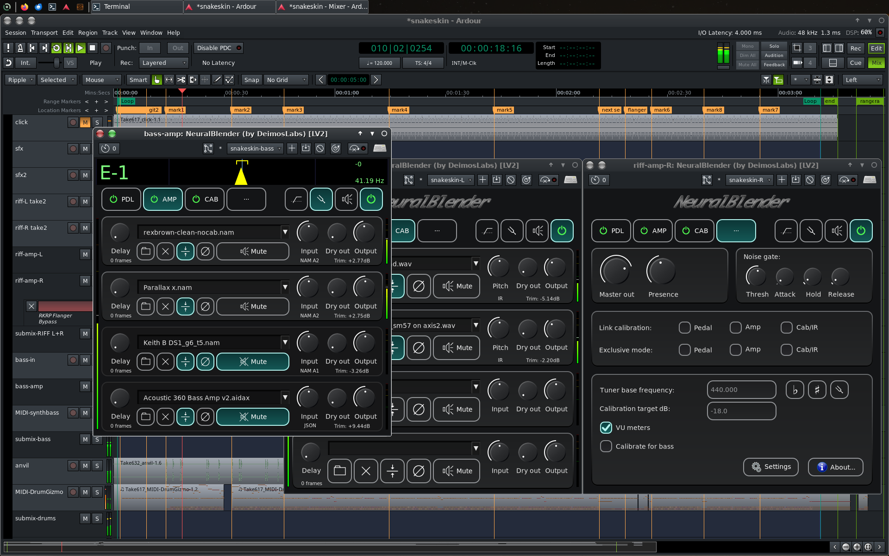
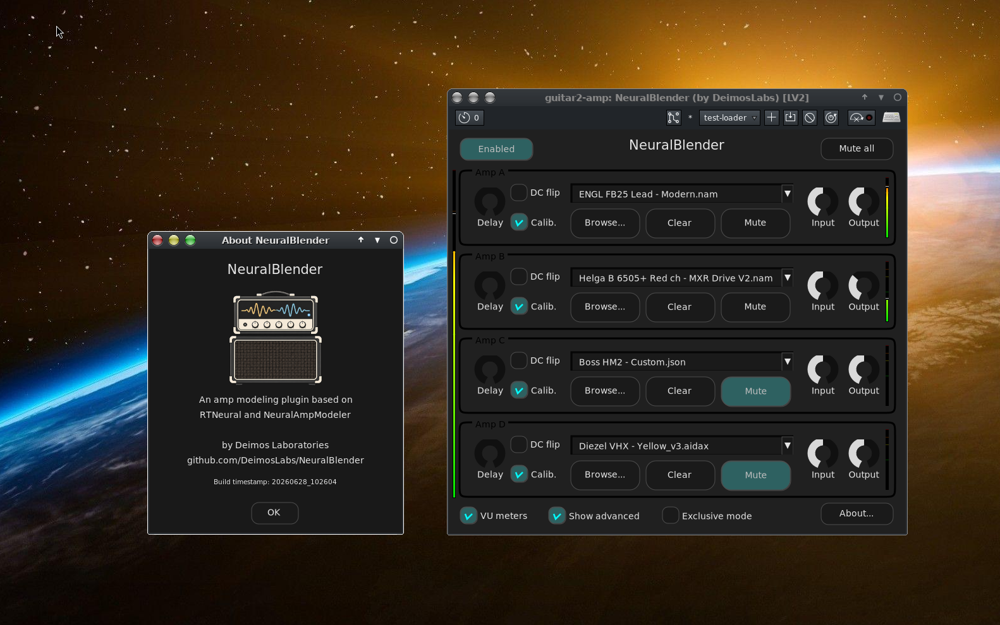
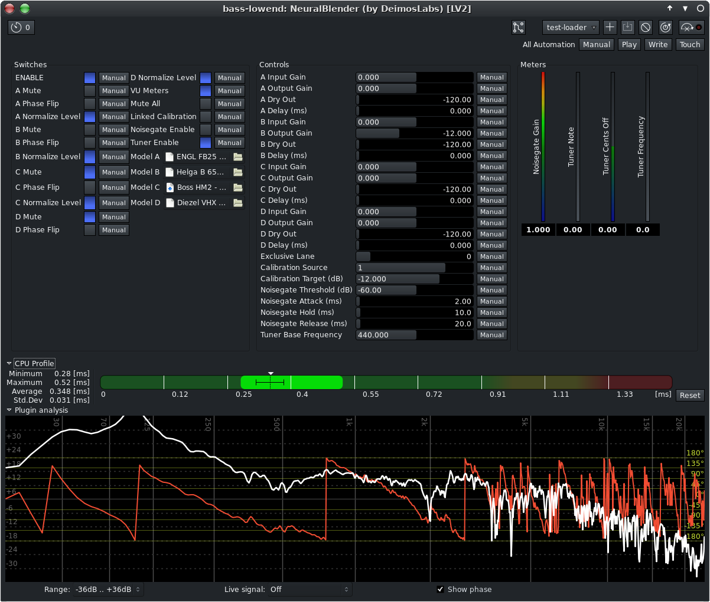

# NeuralBlender

A simple, efficient but feature-rich amp modeling plugin based on RTNeural and NeuralAmpModeler (NAM)

Features:
  - Supports nam A1, nam A2, aidax, and json model files.
  - Full impulse response (convolution) for cab sim
  - Complete stompbox->amp->cab/IR signal flow with 3 "banks" of models
  - Can load up to 4 models on each bank simultaneously 
  - Can either blend them (normal) or switch between them like "channels" (exclusive mode)
  - Standalone app and LV2 plugin
  - Proper multithreading with UI and loader threads separate from DSP
  - VU meters can be disabled to save a tiny bit of DSP load
  - Calibration target dB is now a user defined setting
  - "Linked" calibration mode follows loudest model which has calib. enabled
  - Calibration can be tuned for guitar or bass
  - Tuner, can be enabled/disabled
  - Volume ramping/crossfade when loading, switching etc. to avoid clicks
  - Each model slot / lane has:
    - input gain
    - output gain
    - dry out gain
    - pre-delay for phasing correction/effects
    - optional DC flip for more phasing effects
    - optional level calibration
    - pitch shift for IR's

On my Intel Core7 ultra, it loads 5 or 6 models in the middle of a busy live session, 64 sample buffers / 3 periods, and DSP load typically stays below 50%, no xruns. (with DSP threads pinned to p-cores)

Features considered for future versions: VST plugin, series mode(s), optionally more than 4 lanes per model bank, lane groups, DSP load-splitting/balancing etc...







Compiles and installs with cmake.

Required libraries:
  - eigen3
  - lv2 (for LV2 plugin)
  - jack (for standalone)
  - cairo/x11 (for GUI)
  
See CMakeLists.txt for more details.

To build and install, from an empty build directory run something like:
```
cmake wherver/is/src/neuralblender
make -j `nproc`
sudo make install
```
For the standalone version, see --help text for more info/options

## Supported systems

Should compile and work fine on any POSIX-compliant OS including Linux, MacOS (to be fixed), FreeBSD, etc.

Tested on:
  - Void Linux
  - Linux Mint
  - FreeBSD

MacOS: Expected to work soon, currently needs to be fixed. The only Mac i have is from 1986.

Android: Not really interested in supporting it, but if there's enough demand i'll make an effort.

W**dows: Don't do microsuck malware. It's bad for you, and for everyone else.

## License

NeuralBlender is licensed under the GNU General Public License v3.0 (GPL-3.0-or-later).
See the LICENSE file for full license text.
