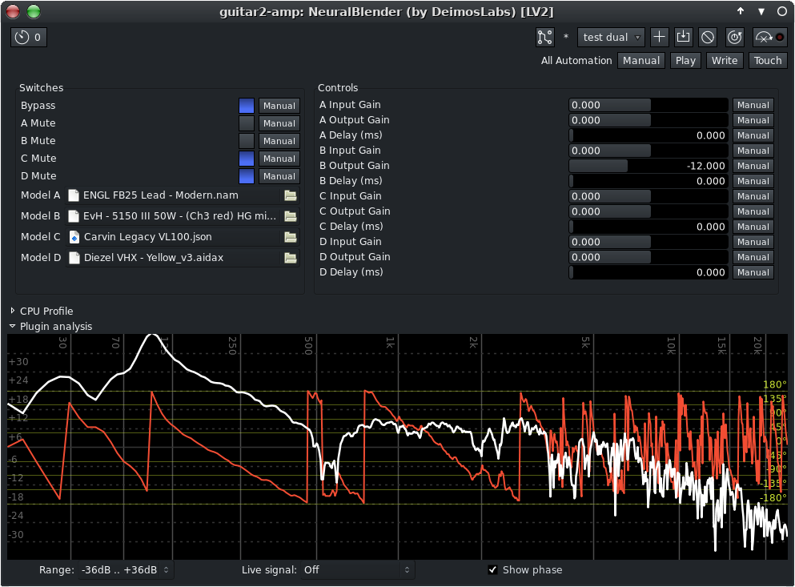

# NeuralBlender

A simple amp modeling plugin based on RTNeural and NeuralAmpModeler (NAM)

Supports nam A1, A2, aidax, and json model files. Can load up to 4 models simultaneously and either blend or switch between them. Each lane has input gain, output gain, and pre-delay for phasing correction/effects.

Doesn't have a custom UI yet, but generic LV2 controls seem to be working fine at least in Ardour and jalv.



Compiles and installs with cmake.
Required libraries: eigen3, lv2, and (for JACK support) libjack.
See CMakeLists.txt for more details.

To build and install, from an empty build directory run something like:
```
cmake wherver/is/src/neuralblender
make -j `nproc`
sudo make install
```
For standalone version, see --help text for more info/options

## Supported systems

Should compile and work fine on any POSIX compliant OS including Linux, MacOS, FreeBSD, etc.

Tested on: As of now, only Void Linux and Linux Mint.

Compiling/running this on w**dows: Short answer, don't do microsuck malware. It's bad for you (and for everyone else)

## License

NeuralBlender is licensed under the GNU General Public License v3.0 (GPL-3.0-or-later).
See the LICENSE file for full license text.
