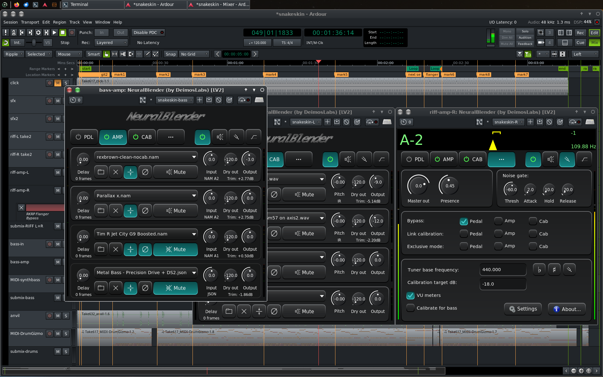
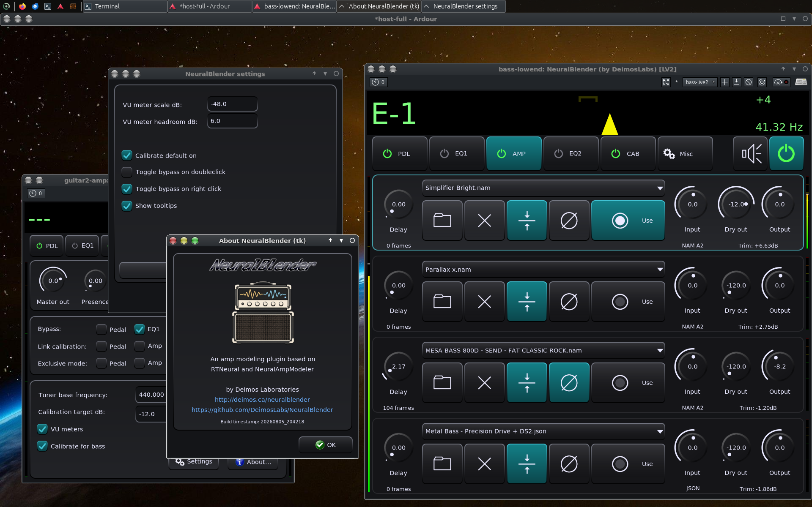
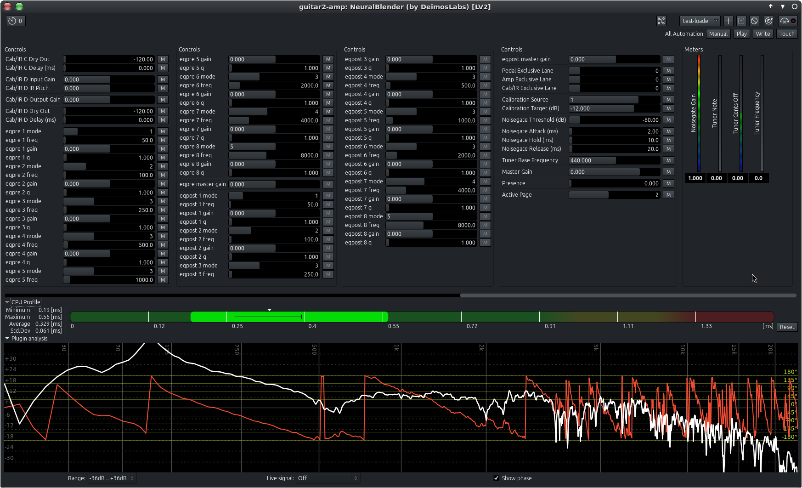

# Thanks to MICROSUCK ABUSING ITS OWNERSHIP OF GITHUB, this project has permanently moved to Sourceforge.

https://sourceforge.net/projects/neuralblender/

# NeuralBlender

A simple, efficient but feature-rich guitar amp modeling plugin based on RTNeural and NeuralAmpModeler (NAM)

Features:
  - Supports nam A1, nam A2, aidax, and json model files.
  - Full impulse response (convolution) for cab sim
  - Reads gzipped files
  - Complete STOMPBOX -> preEQ -> AMP -> postEQ -> CAB/IR signal flow with 3 "banks" of models
  - 8-band parametric pre and post EQ
  - Can load up to 4 models on each bank simultaneously (each model either NAM/json/aidax or IR)
  - Can either blend them (normal) or switch between them like "channels" (exclusive mode)
  - Standalone app and LV2 plugin
  - Proper multithreading with UI and loader threads separate from DSP
  - VU meters can be disabled to save a tiny bit of CPU
  - Calibration target dB is now a user defined setting
  - "Linked" calibration mode follows loudest model which has calib. enabled
  - Calibration can be tuned for guitar or bass
  - Tuner, can be enabled/disabled to save a bit of CPU
  - Volume ramping/crossfade when loading, switching etc. to avoid clicks
  - Each model slot / lane has:
    - input gain if not an impulse response
    - if IR, pitch shift +- 1 octave in 1/100 semitone increments
    - output gain
    - dry out gain
    - pre-delay for phasing correction/effects
    - optional DC flip for more phasing effects
    - optional level calibration to target dB

On my Intel Core7 ultra, it loads 5 or 6 models in the middle of a busy live session, 64 sample buffers / 3 periods, and DSP load typically stays below 40%, no xruns. (with DSP threads pinned to p-cores)

Features considered for future versions: VST plugin, stereo routing, series mode(s), optionally more than 4 lanes per model bank, lane groups, DSP load-splitting/balancing etc...

Demo: https://soundcloud.com/delt01/snakeskin All the guitars and bass in this track are straight DI's processed through NeuralBlender with a bit of reverb, and flanger at one spot. The wah effect was achieved by automating one of the pre-EQ bands. NAM models used are available on https://tone3000.com







No pre-built binaries yet. If anyone would like them, please let me know.

Compiles and installs with cmake. Required libs / utilities to build:
  - fftw-float (for core, required)
  - lv2 (for LV2 plugin)
  - jack (for standalone app)
  - cairo/x11 (for GUI)
  - libsoundfile (for IR support)
  - xxd utility, for inline data
  
On debian/ubuntu/mint, just run:
```bash
sudo apt install git cmake libeigen3-dev libfftw3-dev lv2-dev libjack-dev libcairo2-dev libsndfile1-dev xxd
```
On other distributions, the package names (and package system) are probably different, but still available.

To grab the code, build and install, run something like:
```
git clone https://github.com/DeimosLabs/NeuralBlender
cd NeuralBlender
mkdir build
cd build
cmake ..
make -j$(nproc) && sudo make install
```

To uninstall, go back to the same build directory and run:

```
sudo make uninstall
```

For the standalone version, see --help text for more info/options

## Supported systems

Should compile and work fine on any POSIX-compliant OS including Linux, MacOS (to be fixed), FreeBSD, etc. For now UI uses X11, but recent rewrite should make it easy to port to other graphic systems.

Tested on:
  - Void Linux
  - MX Moksha
  - Linux Mint
  - Fedora
  - FreeBSD

MacOS: Expected to work soon, currently needs to be fixed. The only Mac i have is from 1986.

Android: Not really interested in supporting it, but if there's enough demand i'll make an effort.

W**dows: Don't do microsuck malware. It's bad for you, and for everyone else.

## License

NeuralBlender is licensed under the GNU General Public License v3.0 (GPL-3.0-or-later).
See the LICENSE file for full license text.
